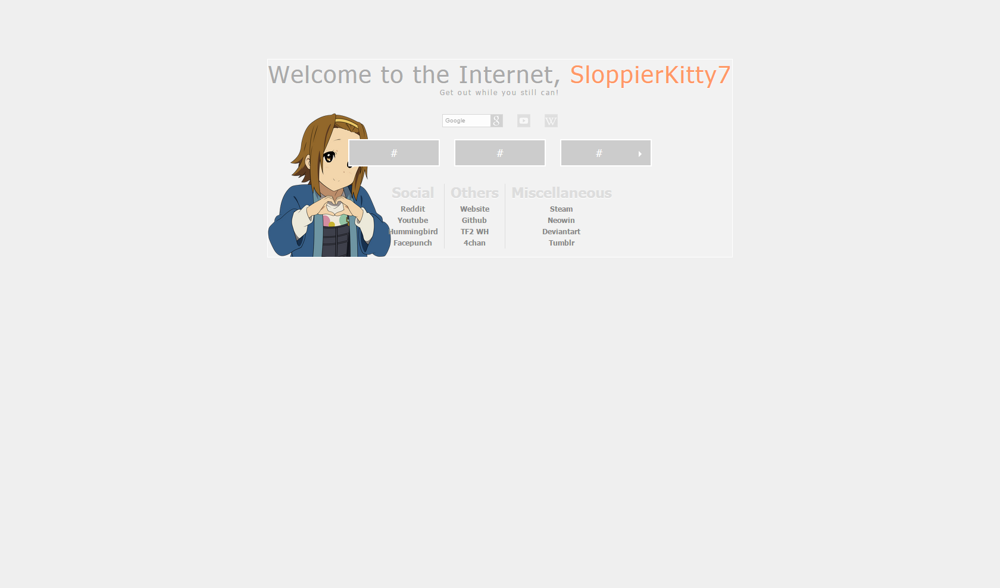

# k-on-new-tab-page
a fork of https://github.com/gokoururi/homepage

# screenshots

# Customizing
If you want to customize any of this, you'll first need to a program that will allow you to edit HTML eg github Atome, subline text, notepade ++, notepad, ect

Open the "tab.html" file in your editor of choice. In this document, you can change the picture that you want to display (Azusa, Mugi, Mio, Ritsu, and Yui; all have a light and a dark version), change the links you want to be displayed on the gray boxes/dropdown box/lists at the bottom, and change any text on the page, such as the name the page welcomes.

To change the K-On displayed, hit Ctrl+F or Ctrl+H, type in "azusa-light" in the first box, and the K-On of your choice followed by a hyphen and either "light" or "dark" depending on the theme you want, then hit replace all. For example, if you want to change it to the light Yui theme, you would do, Ctrl+F or Ctrl+H, type in "azusa-light", type in "yui-light", and hit Replace All.

Now you'll notice there is a block of text that contains several orangish-yellowish words. Don't do anything to that block, but look just below it. There's a tag labeled <!--Edit Inks--> on line 34 . Everything inside that tag is where you edit any links. A link looks like this:
<a href="https://www.youtube.com">YouTube</a>
All the links in this file are contained within lists. So in the file, the above link would appear as:
<li class="button button_grey"><a href="https://www.youtube.com">YouTube</a></li>

We just need to pay attention to the link part, though. The bit inside the quotation marks after 'href=' is the URL of the website you're linking to. Visit whatever website you want to link, copy the URL, and paste it into those quotation marks. Then, the part in the above link that just says 'YouTube' and is sandwiched between a greater than and lesser than sign (>YouTube</a>) is what text will display. You can change that to whatever you want.
So for instance, let's say I wanted to change the above YouTube link to link to, say, /r/magicTCG. Well, first, we'd

change the link, so it'd look like this:
<a href="https://www.reddit.com/r/magicTCG">YouTube</a>

This still looks like it links to YouTube, though, even though it links to the Magic subreddit. Well, let's look at the next step to fix that.

<a href="https://www.reddit.com/r/magicTCG">Magic: the Subredditing</a>
Now our link will display as "Magic: the Subredditing". Neat, huh?

For this next part, you can again use the Ctrl+F function. In the first text box, type in "SloppierKitty7", and in the second, type in whatever you want the page to call you. I chose my name, but seeing as my name is "SloppierKitty7" I will use the name "Yui" in the second text box. When we hit Replace All, it should replace "SloppierKitty7" with "Yui", and now when we open a new tab, we'll see the phrase, "Welcome to the Internet, Yui"
In the same line as the one you just altered to say Greg, you can also find the text that says "Welcome to the Internet, ". You can change this to whatever you want, as well. In fact, you could take it out entirely. Same with the line below it, which reads, "Get out while you still can!" Do whatever you want with it. Have fun!

if you need help with this ask me on subreddit
https://www.reddit.com/r/k_on/comments/3brown/kon_new_tab_page_release/

list of theme
* azusa-dark
* azusa-light
* mio-dark
* mio-light
* mugi-dark
* mugi-light
* ritsu-dark
* ritsu-light
* yui-dark
* yui-light

# how to install

make a folder in "C:\Users\your_name" name it tab_page and put the files in to it then open up chrome and go to seting then extensions you will need to enable developer mode next click load unpacked extension and look for th tab_page folder and hit ok you should see a new extension name "K-on New tab" new open a new tab and it should work

#Features planned
* use a config file for modifying links
* add themes for Ton & Ui & Sawako & Nodoka
* put the plugin on chrome web store
* make a demo
